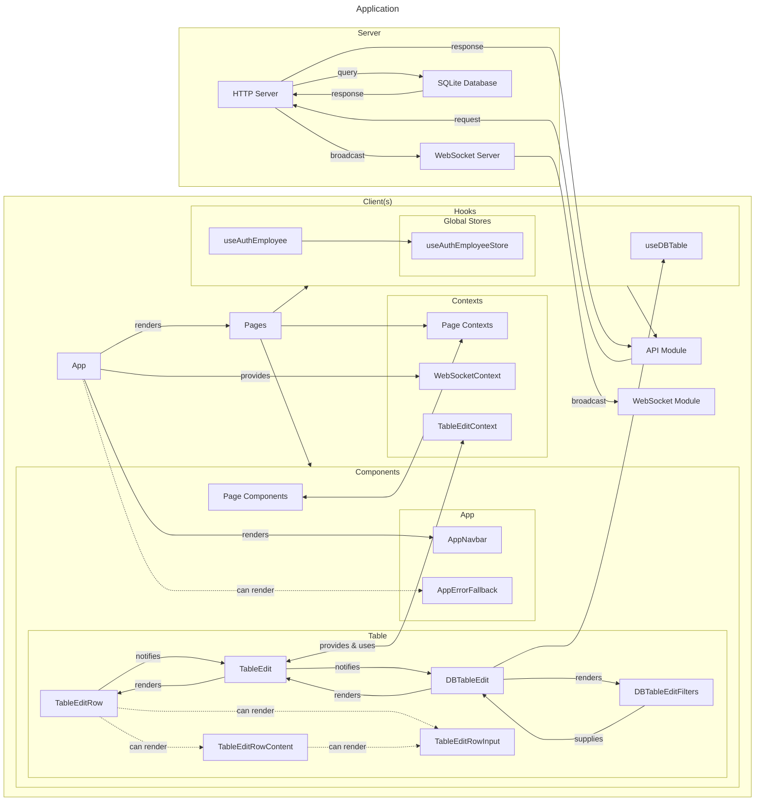

# Starostwo-app

## Tech Stack

-   React
-   TypeScript
-   Vite
-   Express
-   MySQL
-   Zod
-   JWT
-   Joy UI

## Application

Diagram



## TODO

See [TODO.md](./TODO.md)

## Building

`docker compose up --build`

```bat
docker save -o images/client.tar starostwo-app-client:latest
docker save -o images/server.tar starostwo-app-server:latest
```

### On server

copy images from the `images/` folder and copy [docker-compose.yaml](./docker-compose.yaml)

```bat
docker load < server.tar
docker load < client.tar
```

```bat
docker compose up -d
```

## ...

%AppData%/XYplorer/tag.data

## ꙮ𓀐𖡡Ɐ⨎⨍⟊⚙️⫸⧖⧚⧜Ɽ𒋝

-   🌀 ꙮ𖣔⫴⨌𓋑⨘𒀲 𖡆𒋓𓄿.𖡟.
-   🌋 ⫸𖡄𒐫Ɽ𓄿𓋔.
-   🛠️ ⟊⫴𖡑⫷⧖⫸⟊⟆⨌.
-   🚀 ⫷𒋔⨀𒀱⨎⟊⫴𖡰.
-   🌌 ⟆⨙⫴𖣔⟊⟑Ɽ𖡛.
