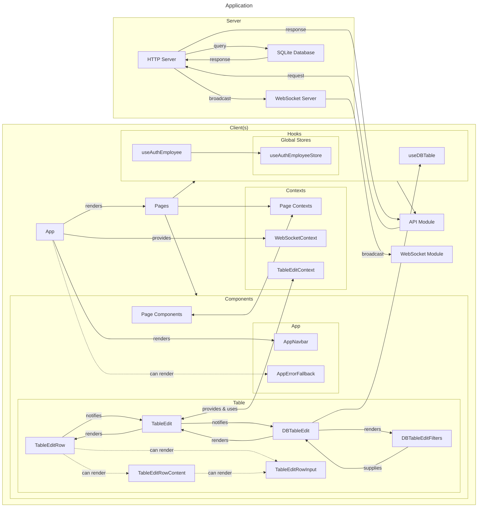

# Starostwo-app

## Tech Stack

-   React
-   TypeScript
-   Vite
-   Express
-   MySQL
-   Zod
-   JWT
-   Joy UI

## Application

Diagram

```mermaid
---
title: Application
---
flowchart LR
    subgraph Server
        WSServer[WebSocket Server]
        HTTPServer[HTTP Server]
        SQLiteDatabase[SQLite Database]

        HTTPServer --broadcast--> WSServer
        HTTPServer --query--> SQLiteDatabase
        SQLiteDatabase --response--> HTTPServer
    end
    subgraph Client["Client(s)"]
        ClientAPIModule[API Module]
        ClientWSModule[WebSocket Module]
        ClientPages[Pages]
        ClientApp[App]
        subgraph ClientContexts[Contexts]
            ClientPageContexts[Page Contexts]
            ClientContextWebSocket[WebSocketContext]
            ClientContextTableEdit[TableEditContext]
        end
        subgraph ClientComponents[Components]
            subgraph ClientComponentsTable[Table]
                ClientComponentTableEditRow[TableEditRow]
                ClientComponentTableEdit[TableEdit]
                ClientComponentDBTableEdit[DBTableEdit]
                ClientComponentDBTableEditFilters[DBTableEditFilters]
                ClientComponentTableEditRowInput[TableEditRowInput]
                ClientComponentTableEditRowContent[TableEditRowContent]
            end
            ClientPageComponents[Page Components]
            subgraph ClientComponentsApp[App]
                ClientComponentAppNavbar[AppNavbar]
                ClientComponentAppErrorFallback[AppErrorFallback]
            end

            ClientComponentDBTableEdit --renders--> ClientComponentTableEdit
            ClientComponentDBTableEdit --renders--> ClientComponentDBTableEditFilters
            ClientComponentDBTableEditFilters --supplies--> ClientComponentDBTableEdit
            ClientComponentTableEdit --renders--> ClientComponentTableEditRow
            ClientComponentTableEditRow --notifies--> ClientComponentTableEdit
            ClientComponentTableEdit --notifies--> ClientComponentDBTableEdit
            ClientComponentTableEditRow -.can render.-> ClientComponentTableEditRowInput
            ClientComponentTableEditRow -.can render.-> ClientComponentTableEditRowContent
            ClientComponentTableEditRowContent -.can render.-> ClientComponentTableEditRowInput
            ClientComponentTableEdit <--provides & uses--> ClientContextTableEdit
        end
        subgraph ClientHooks[Hooks]
            ClientHookUseDBTable[useDBTable]
            ClientHookUseAuthEmployee[useAuthEmployee]
            subgraph ClientHooksGlobalStores[Global Stores]
                ClientHooksGlobalStoreAuthEmployee[useAuthEmployeeStore]
            end
        end
        ClientApp --provides--> ClientContextWebSocket
        ClientApp --renders--> ClientPages
        ClientApp --renders--> ClientComponentAppNavbar
        ClientApp -.can render.-> ClientComponentAppErrorFallback
        ClientPageComponents <--> ClientPageContexts
        ClientHookUseAuthEmployee --> ClientHooksGlobalStoreAuthEmployee
        ClientPages --> ClientComponents
        ClientComponentDBTableEdit --> ClientHookUseDBTable
        ClientHooks --> ClientAPIModule
        ClientPages --> ClientHooks
        ClientPages --> ClientPageContexts
    end
    WSServer --broadcast--> ClientWSModule
    ClientAPIModule --request--> HTTPServer
    HTTPServer --response--> ClientAPIModule
```
